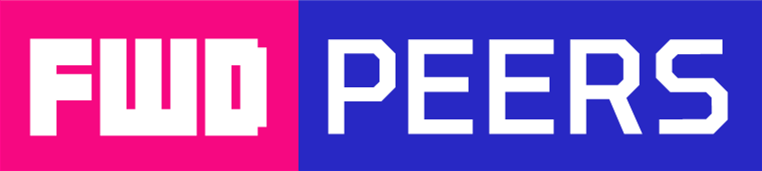

  <h1 align="center">Filipino Web Development Peers 🇵🇭</h1>

  
  
  

  &nbsp&nbsp&nbsp&nbsp&nbsp
  &nbsp&nbsp&nbsp&nbsp&nbsp
  
</>

  Filipino Web Development Peers or (FWDP) is a passionate community of Filipino developers and learners focused on enhancing their web development skills. Through workshops, networking events, and collaborative projects, FWDP provides a platform for skill development, knowledge sharing, and professional growth. Join us to be part of a vibrant community dedicated to advancing web development in the Philippines.

---

<h3 align="center">Socials</h3>

  &nbsp&nbsp
  &nbsp&nbsp
  

